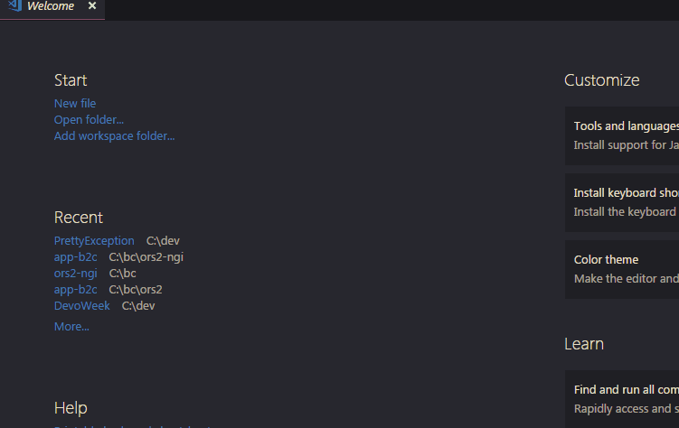

# Pretty Exception

_Visual Studio Code extension for formatting exceptions returned by API serialized with JSON._

## Demo

## How to install

Open extension manager in Visual Studio Code and type `Pretty Exception`.

## How to use

Open new window and paste raw reposne from API with exception.
Then press `Ctrl+Shift+P`, type `Pretty exception` and hit `Enter`.

Your exception should now:

* be formatted as JSON (ish)
* have all whitespace characters converted to what they stand for
